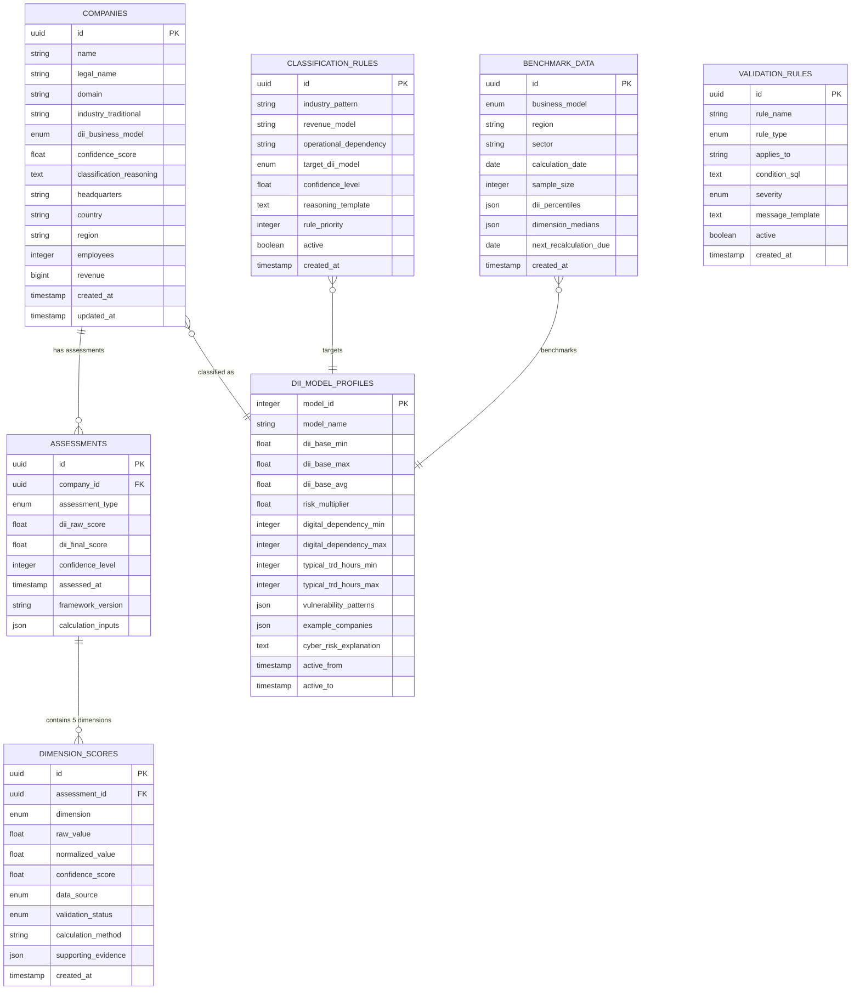
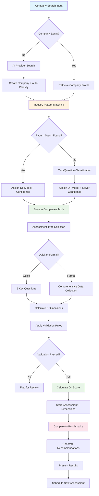
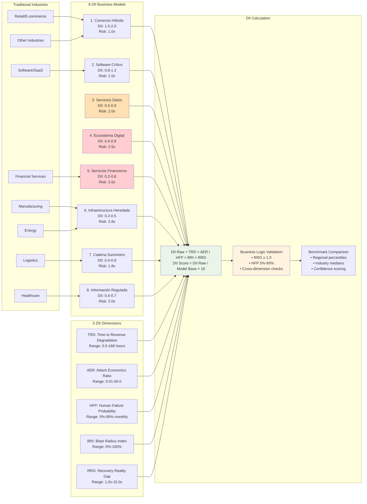
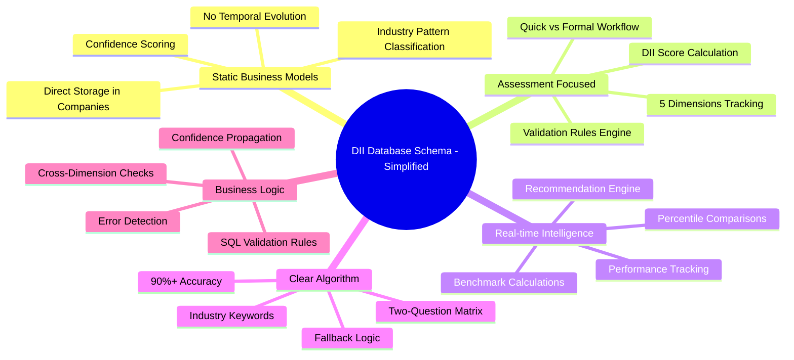

# DII Business Model Database Schema (Simplified 80/20 Approach)

## Entity Relationship Diagram

## Simplified Data Flow (80/20 Approach)

## Business Logic Flow

## Simplified Schema Key Features (80/20)

## Key Simplifications Made

### ✅ **Removed Complex Features (20% that was 80% complexity):**
1. **❌ Temporal Business Model Evolution** - Companies have stable models
2. **❌ Separate Classification History Table** - Stored directly in companies
3. **❌ Complex User Permission System** - Simplified user tracking
4. **❌ Advanced Analytics Engine** - Focus on core assessment
5. **❌ Multi-Model Companies** - One model per company

### ✅ **Kept Essential Features (80% business value):**
1. **✅ Clear Classification Algorithm** - Industry patterns + Two questions
2. **✅ The 8 DII Business Models** - Complete framework support
3. **✅ Assessment Workflow** - Quick and formal assessments
4. **✅ Real-time Benchmarking** - Regional and model-based comparisons
5. **✅ Validation Engine** - Business logic enforcement
6. **✅ Confidence Scoring** - Data quality tracking
7. **✅ Cross-Analysis Bridge** - Traditional industries ↔ DII models

### 🎯 **Core Database Tables (7 total):**
1. **`companies`** - Master company registry with DII classification
2. **`assessments`** - Assessment results over time
3. **`dimension_scores`** - The 5 DII dimensions for each assessment
4. **`dii_model_profiles`** - Static business model definitions
5. **`classification_rules`** - Algorithm pattern matching rules
6. **`benchmark_data`** - Real-time percentile calculations
7. **`validation_rules`** - Business logic validation checks

This approach delivers **the complete DII assessment capability** with **minimal complexity**, focusing on the workflow that matters most: **Company → Classification → Assessment → Results → Benchmarks**.