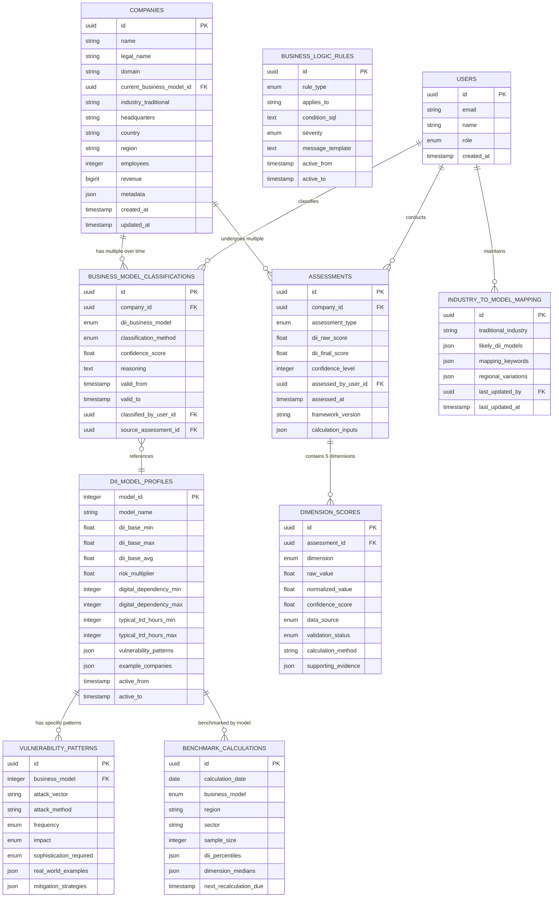
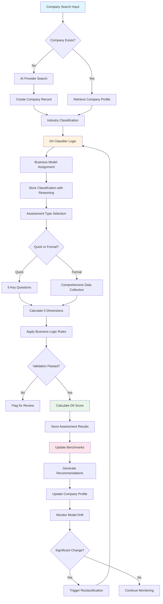
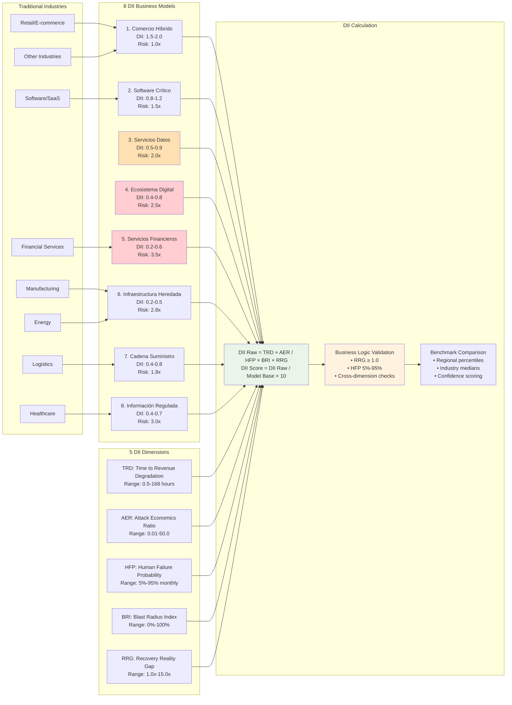
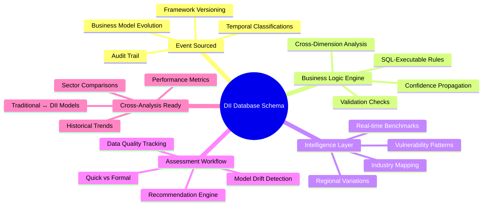

# DII Business Model Database Schema

## Entity Relationship Diagram

```mermaid
erDiagram
    %% Core Entities
    COMPANIES {
        uuid id PK
        string name
        string legal_name
        string domain
        uuid current_business_model_id FK
        string industry_traditional
        string headquarters
        string country
        string region
        integer employees
        bigint revenue
        json metadata
        timestamp created_at
        timestamp updated_at
    }

    BUSINESS_MODEL_CLASSIFICATIONS {
        uuid id PK
        uuid company_id FK
        enum dii_business_model
        enum classification_method
        float confidence_score
        text reasoning
        timestamp valid_from
        timestamp valid_to
        uuid classified_by_user_id FK
        uuid source_assessment_id FK
    }

    DII_MODEL_PROFILES {
        integer model_id PK
        string model_name
        float dii_base_min
        float dii_base_max
        float dii_base_avg
        float risk_multiplier
        integer digital_dependency_min
        integer digital_dependency_max
        integer typical_trd_hours_min
        integer typical_trd_hours_max
        json vulnerability_patterns
        json example_companies
        timestamp active_from
        timestamp active_to
    }

    %% Assessment Engine
    ASSESSMENTS {
        uuid id PK
        uuid company_id FK
        enum assessment_type
        float dii_raw_score
        float dii_final_score
        integer confidence_level
        uuid assessed_by_user_id FK
        timestamp assessed_at
        string framework_version
        json calculation_inputs
    }

    DIMENSION_SCORES {
        uuid id PK
        uuid assessment_id FK
        enum dimension
        float raw_value
        float normalized_value
        float confidence_score
        enum data_source
        enum validation_status
        string calculation_method
        json supporting_evidence
    }

    BUSINESS_LOGIC_RULES {
        uuid id PK
        enum rule_type
        string applies_to
        text condition_sql
        enum severity
        text message_template
        timestamp active_from
        timestamp active_to
    }

    %% Intelligence Layer
    INDUSTRY_TO_MODEL_MAPPING {
        uuid id PK
        string traditional_industry
        json likely_dii_models
        json mapping_keywords
        json regional_variations
        uuid last_updated_by FK
        timestamp last_updated_at
    }

    BENCHMARK_CALCULATIONS {
        uuid id PK
        date calculation_date
        enum business_model
        string region
        string sector
        integer sample_size
        json dii_percentiles
        json dimension_medians
        timestamp next_recalculation_due
    }

    VULNERABILITY_PATTERNS {
        uuid id PK
        integer business_model FK
        string attack_vector
        string attack_method
        enum frequency
        enum impact
        enum sophistication_required
        json real_world_examples
        json mitigation_strategies
    }

    %% User Management (simplified)
    USERS {
        uuid id PK
        string email
        string name
        enum role
        timestamp created_at
    }

    %% Relationships
    COMPANIES ||--o{ BUSINESS_MODEL_CLASSIFICATIONS : "has multiple over time"
    COMPANIES ||--o{ ASSESSMENTS : "undergoes multiple"
    BUSINESS_MODEL_CLASSIFICATIONS }o--|| DII_MODEL_PROFILES : "references"
    ASSESSMENTS ||--o{ DIMENSION_SCORES : "contains 5 dimensions"
    USERS ||--o{ ASSESSMENTS : "conducts"
    USERS ||--o{ BUSINESS_MODEL_CLASSIFICATIONS : "classifies"
    USERS ||--o{ INDUSTRY_TO_MODEL_MAPPING : "maintains"
    DII_MODEL_PROFILES ||--o{ VULNERABILITY_PATTERNS : "has specific patterns"
    DII_MODEL_PROFILES ||--o{ BENCHMARK_CALCULATIONS : "benchmarked by model"
```

## Data Flow Diagram

```mermaid
flowchart TD
    %% Input Sources
    A[Company Search Input] --> B{Company Exists?}
    B -->|No| C[AI Provider Search]
    B -->|Yes| D[Retrieve Company Profile]
    C --> E[Create Company Record]
    
    %% Business Model Classification
    E --> F[Industry Classification]
    D --> F
    F --> G[DII Classifier Logic]
    G --> H[Business Model Assignment]
    H --> I[Store Classification with Reasoning]
    
    %% Assessment Process
    I --> J[Assessment Type Selection]
    J --> K{Quick or Formal?}
    K -->|Quick| L[5 Key Questions]
    K -->|Formal| M[Comprehensive Data Collection]
    
    %% Calculation Engine
    L --> N[Calculate 5 Dimensions]
    M --> N
    N --> O[Apply Business Logic Rules]
    O --> P{Validation Passed?}
    P -->|No| Q[Flag for Review]
    P -->|Yes| R[Calculate DII Score]
    
    %% Intelligence Layer
    R --> S[Store Assessment Results]
    S --> T[Update Benchmarks]
    T --> U[Generate Recommendations]
    U --> V[Update Company Profile]
    
    %% Feedback Loop
    V --> W[Monitor Model Drift]
    W --> X{Significant Change?}
    X -->|Yes| Y[Trigger Reclassification]
    X -->|No| Z[Continue Monitoring]
    Y --> G
    
    style A fill:#e1f5fe
    style G fill:#fff3e0
    style R fill:#e8f5e8
    style T fill:#fce4ec
```

## Business Logic Flow

```mermaid
flowchart LR
    %% The 8 DII Business Models
    subgraph "8 DII Business Models"
        BM1[1. Comercio Híbrido<br/>DII: 1.5-2.0<br/>Risk: 1.0x]
        BM2[2. Software Crítico<br/>DII: 0.8-1.2<br/>Risk: 1.5x]
        BM3[3. Servicios Datos<br/>DII: 0.5-0.9<br/>Risk: 2.0x]
        BM4[4. Ecosistema Digital<br/>DII: 0.4-0.8<br/>Risk: 2.5x]
        BM5[5. Servicios Financieros<br/>DII: 0.2-0.6<br/>Risk: 3.5x]
        BM6[6. Infraestructura Heredada<br/>DII: 0.2-0.5<br/>Risk: 2.8x]
        BM7[7. Cadena Suministro<br/>DII: 0.4-0.8<br/>Risk: 1.8x]
        BM8[8. Información Regulada<br/>DII: 0.4-0.7<br/>Risk: 3.0x]
    end
    
    %% The 5 Dimensions
    subgraph "5 DII Dimensions"
        TRD[TRD: Time to Revenue Degradation<br/>Range: 0.5-168 hours]
        AER[AER: Attack Economics Ratio<br/>Range: 0.01-50.0]
        HFP[HFP: Human Failure Probability<br/>Range: 5%-95% monthly]
        BRI[BRI: Blast Radius Index<br/>Range: 0%-100%]
        RRG[RRG: Recovery Reality Gap<br/>Range: 1.0x-15.0x]
    end
    
    %% Calculation Process
    subgraph "DII Calculation"
        CALC[DII Raw = TRD × AER / HFP × BRI × RRG<br/>DII Score = DII Raw / Model Base × 10]
        VALID[Business Logic Validation<br/>• RRG ≥ 1.0<br/>• HFP 5%-95%<br/>• Cross-dimension checks]
        BENCH[Benchmark Comparison<br/>• Regional percentiles<br/>• Industry medians<br/>• Confidence scoring]
    end
    
    %% Traditional Industry Mapping
    subgraph "Traditional Industries"
        IND1[Software/SaaS]
        IND2[Financial Services]
        IND3[Retail/E-commerce]
        IND4[Manufacturing]
        IND5[Healthcare]
        IND6[Logistics]
        IND7[Energy]
        IND8[Other Industries]
    end
    
    %% Connections
    IND1 --> BM2
    IND2 --> BM5
    IND3 --> BM1
    IND4 --> BM6
    IND5 --> BM8
    IND6 --> BM7
    IND7 --> BM6
    IND8 --> BM1
    
    BM1 --> CALC
    BM2 --> CALC
    BM3 --> CALC
    BM4 --> CALC
    BM5 --> CALC
    BM6 --> CALC
    BM7 --> CALC
    BM8 --> CALC
    
    TRD --> CALC
    AER --> CALC
    HFP --> CALC
    BRI --> CALC
    RRG --> CALC
    
    CALC --> VALID
    VALID --> BENCH
    
    style BM5 fill:#ffcdd2
    style BM4 fill:#ffcdd2
    style BM3 fill:#ffe0b2
    style CALC fill:#e8f5e8
    style VALID fill:#fff3e0
```

## Database Schema Key Features

```mermaid
mindmap
  root((DII Database Schema))
    Event Sourced
      Business Model Evolution
      Temporal Classifications
      Audit Trail
      Framework Versioning
    
    Business Logic Engine
      SQL-Executable Rules
      Validation Checks
      Cross-Dimension Analysis
      Confidence Propagation
    
    Intelligence Layer
      Industry Mapping
      Real-time Benchmarks
      Vulnerability Patterns
      Regional Variations
    
    Assessment Workflow
      Quick vs Formal
      Data Quality Tracking
      Recommendation Engine
      Model Drift Detection
    
    Cross-Analysis Ready
      Traditional ↔ DII Models
      Historical Trends
      Sector Comparisons
      Performance Metrics
```