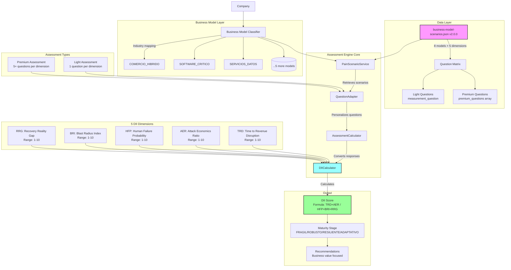

# Assessment Engine Architecture

## Overview
The assessment engine is built on a modular architecture that separates data, business logic, and presentation layers. It supports both light (single question per dimension) and premium (multiple questions) assessment modes.

## Architecture Diagram



## Component Details

### 1. Knowledge Base Structure
```json
{
  "version": "2.0.0",
  "business_models": {
    "COMERCIO_HIBRIDO": {
      "dimensions": {
        "TRD": {
          "pain_point": "System failures directly impact sales",
          "measurement_question": "How quickly do system failures impact revenue?",
          "responses": [
            { "value": 1, "metric": 60, "label": "Within 1 hour" },
            { "value": 2, "metric": 180, "label": "Within 3 hours" },
            // ... more options
          ]
        },
        // ... other dimensions
      }
    }
    // ... other business models
  }
}
```

### 2. Dimension Modularity

Each dimension is:
- **Independent**: Can be assessed separately
- **Configurable**: Questions and metrics stored as data
- **Extensible**: New dimensions can be added
- **Normalized**: All dimensions use 1-10 scale

### 3. Question Selection Logic

```typescript
// Light Assessment
if (assessmentType === 'light') {
  return scenario.measurement_question; // Single question
}

// Premium Assessment (future)
if (assessmentType === 'premium') {
  return scenario.premium_questions; // Multiple questions
}
```

### 4. Key Architectural Decisions

1. **JSON-based Configuration**: Questions and scenarios are data, not code
2. **Type Safety**: Full TypeScript typing throughout
3. **Business Model Driven**: Questions adapt to company type
4. **Formula-based Scoring**: Mathematical model for DII calculation
5. **Extensible Design**: Easy to add new models, dimensions, or question types

## Extension Points

### Adding New Dimensions
1. Update `DimensionId` type
2. Add to formula in `DIICalculator`
3. Add scenarios in JSON for each business model
4. Update UI components

### Adding New Business Models
1. Add to `BusinessModelId` type
2. Create scenarios for all 5 dimensions
3. Add to classifier mapping
4. Update archetype groupings

### Customizing Questions
1. Modify `business-model-scenarios.json`
2. Update `QuestionAdapter` for new personalization
3. Add response interpretation logic

## Current Implementation Status

- ✅ Light Assessment: Fully implemented
- ✅ 8 Business Models: Complete coverage
- ✅ 5 Dimensions: All active
- ✅ DII Calculation: Working
- ⏳ Premium Assessment: Infrastructure ready, not active
- ⏳ AI Enhancement: Partial implementation